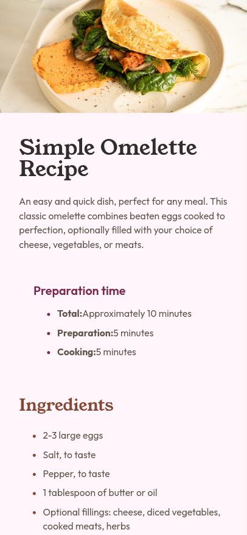

# Frontend Mentor - Recipe page solution

This is a solution to the [Recipe page challenge on Frontend Mentor](https://www.frontendmentor.io/challenges/recipe-page-KiTsR8QQKm). Frontend Mentor challenges help you improve your coding skills by building realistic projects.

## Table of contents

- [Overview](#overview)
  - [The challenge](#the-challenge)
  - [Screenshot](#screenshot)
  - [Links](#links)
- [My process](#my-process)

  - [Built with](#built-with)
  - [What I learned](#what-i-learned)

- [Author](#author)

## Overview

### Screenshot

### Links

- Parent Project: [https://github.com/ortiz-antonio/frontend-mentor](https://github.com/ortiz-antonio/frontend-mentor)
- Solution URL: [https://github.com/ortiz-antonio/recipe-page](https://github.com/ortiz-antonio/recipe-page)
- Live Site URL: [https://ortiz-antonio.github.io/recipe-page](https://ortiz-antonio.github.io/recipe-page/)

## My process

### Built with

- Semantic HTML5 markup
- SCSS
- Nunjucks
- Flexbox
- Mobile-first workflow
- Taskfile
- Eleventy

### What I learned

I have gained more experience with media queries, fluid layouts, and flexbox.

## Author

- Website - [Antonio Ortiz](https://ortiz.studio)
- Frontend Mentor - [@ortiz-antonio](https://www.frontendmentor.io/profile/ortiz-antonio)
